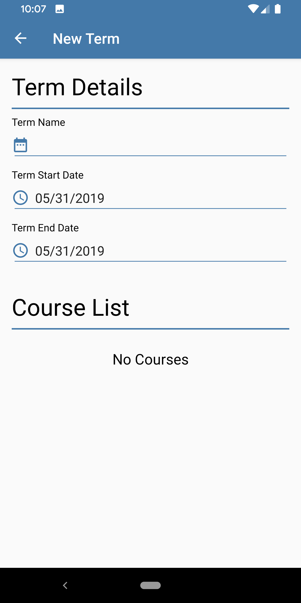
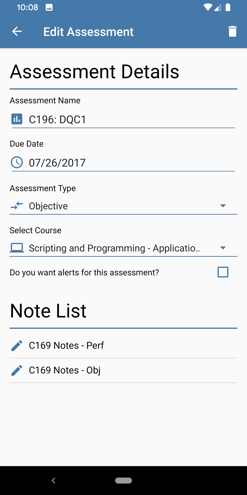

# Semester Tracker
---

Simple android app that lets the user track your university semesters, courses, assessments and notes. This was a project for a class I took at Western Governors University. The UI is styled in the manner of Material Design; Google's Style Guide and uses AndroidX libraries.

## General
---

The App is broken up into two layout types: a List Fragment for a type of object (RecyclerView so Cards can be used). And a Detail Activity for each type of Object. The Detail Activity uses intents to instantiate whether it should load an object and become an Edit type or instantiate a blank object and become a New type. It features both Programmatic and Declarative methods for creating the user interface.

Supports versions of Android: API 23 and up. Target API is 28 (Android Pie).

Utilizing the Back Stack as well as strong Foreign Keys, it is possible to navigate between Detail Activities for each object type in the tree:
Terms -> Courses -> Assessments -> Notes.

Notes can be shared via a Share dialog and Notifications can be set for both Assessments and Courses for important dates like due dates for Assessments, start and ending dates for Courses. These notifications utilize the AlarmManager in order to display alerts for when the app is in the background or closed.

The Room framework was used to handle the SQLite database for the app and the app architecture follows Google's recommended MVVM architecture - Model View ViewModel.
- POJO Models (Entities) for each object type.
- DAO interfaces for each Entity.
- Repository classes for implementing each DAO.
- ViewModels for handling the LiveData lifecycle for each repository - this abstracts all data interaction away from main UI thread.

Database Schema:
```
CREATE TABLE terms (
    id INTEGER PRIMARY KEY AUTOINCREMENT,
    term_name TEXT,
    term_start_date TEXT,
    term_end_date TEXT,
    term_active INTEGER
);

CREATE TABLE courses (
    id INTEGER PRIMARY KEY AUTOINCREMENT,
    term_id INTEGER,
    course_name TEXT,
    course_start_date TEXT,
    course_end_date TEXT,
    course_mentor_name TEXT,
    course_mentor_phone TEXT,
    course_mentor_email TEXT,
    course_status TEXT,
    course_notification INTEGER,
    FOREIGN KEY (term_id) REFERENCES terms(id)
);

CREATE TABLE course_notes (
    id INTEGER PRIMARY KEY AUTOINCREMENT,
    course_id INTEGER,
    note_body TEXT,
    FOREIGN KEY (course_id) REFERENCES courses(id)
);

CREATE TABLE assessments (
    id INTEGER PRIMARY KEY AUTOINCREMENT,
    course_id INTEGER,
    assessment_name TEXT,
    assessment_type TEXT,
    assessment_due_date TEXT,
    assessment_notification INTEGER,
    FOREIGN KEY (course_id) REFERENCES courses(id)
);

```

## Screenshots
---

### Side Navigation Menu:


### List Fragments:

Terms List | Courses List | Assessments List | Notes List
:---------:|:------------:|:----------------:|:----------:
 |  |  | 

### Detail Activities:
New Term | New Course | New Course Ext | New Assessment | New Note
:-------:|:----------:|:--------------:|:--------------:|:--------:
 |  |  |  | 

Edit Term | Edit Course | Edit Course Ext | Edit Assessment | Edit Note
:--------:|:-----------:|:---------------:|:---------------:|:---------:
 |  |  |  | 

### Share Note:


## Storyboard
---
